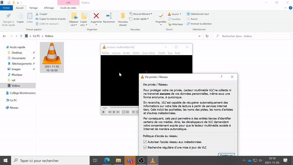
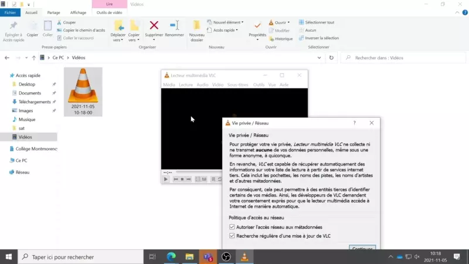

# recette_de_ramen_2
le retour de la soupe ramen 

## images en boucles
### gifs
* 
### png seq
* 
### webp
* 

## titre 2 A

petite introduction

```html
<head>
    <meta charset="UTF-8">
    <meta name="viewport" content="width=device-width, initial-scale=1.0">
    <meta http-equiv="X-UA-Compatible" content="ie=edge">
    <title>HTML 5 Boilerplate</title>
    <link rel="stylesheet" href="style.css">
</head>
```

### titre 3 a

ici je vais avoir un premier sujet

### titre 3 b 

le deuxième sujet

### titre 3 c
le troisième 

## titre 2

```
test de code 
```

```
je pourrais du code sur une première ligne comme ça
et une deuxième ligne comme ça aussi 
```
### titre 3 a
et 
### titre 3 b 
ce 
### titre 3 c
tera 
